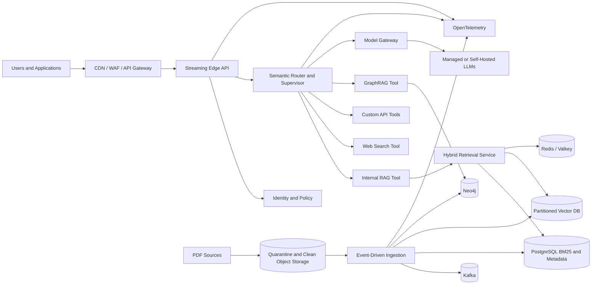
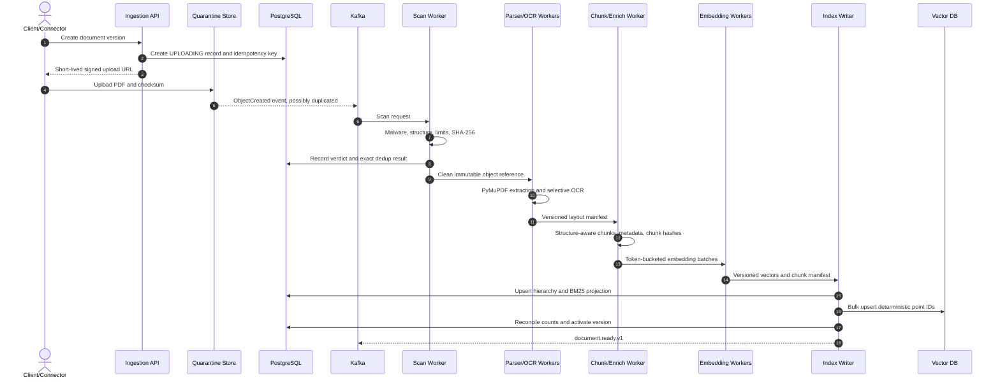
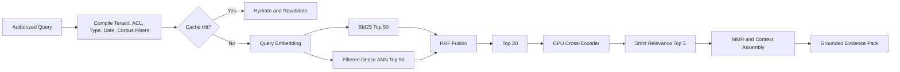
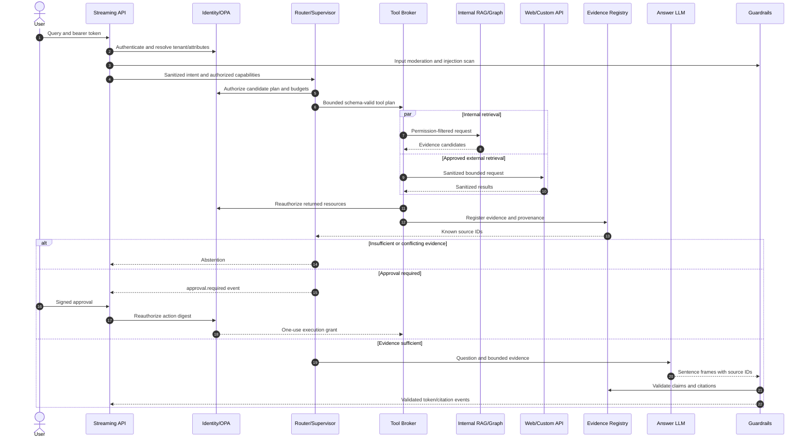

# Hyperscale RAG and Agentic AI Platform Architecture

**Status:** Proposed reference architecture

**Scope:** 10,000,000+ complex PDFs, hybrid retrieval, autonomous tool use, web search, GraphRAG, and multi-cloud/on-premises deployment

**Primary objective:** Build a controlled retrieval platform that remains fast, secure, observable, and rebuildable as the corpus grows into hundreds of millions of chunks.

**Architecture principle:** More indexed data is a liability unless routing, filtering, partitioning, and lifecycle controls reduce the search space before expensive retrieval and generation.

---

## 1. Executive Summary

This platform is divided into five independently scalable planes:

1. **Ingestion plane:** Accepts untrusted files, scans and extracts them, creates structure-aware chunks, deduplicates content, enriches metadata, computes embeddings offline, and publishes versioned search projections.
2. **Retrieval plane:** Applies tenant, ACL, corpus, type, and date filters before running sparse BM25 and dense ANN searches in parallel. Reciprocal Rank Fusion (RRF), a CPU cross-encoder, Max Marginal Relevance (MMR), and extractive compression produce a small, grounded evidence set.
3. **Agent plane:** Uses a deterministic semantic router and a bounded tool-calling supervisor to select internal RAG, web search, GraphRAG, Jira, Salesforce, or other approved APIs.
4. **Serving plane:** Streams validated answer tokens and source events through an API gateway while enforcing identity, policy, budgets, guardrails, and citation integrity.
5. **Platform plane:** Packages services in containers, deploys them to Kubernetes, provisions provider-specific infrastructure through Terraform/OpenTofu, and operates them with GitOps, autoscaling, telemetry, SLOs, and disaster recovery.

### 1.1 Recommended Reference Stack

| Capability | Recommended default | Alternative or portability adapter |
|---|---|---|
| Service runtime | Python 3.12, FastAPI, Pydantic, `asyncio` | Go for high-throughput edge components |
| PDF extraction | PyMuPDF first, pdfplumber selectively | Managed document AI for difficult layouts |
| OCR | Tesseract/PaddleOCR workers | Textract, Document AI, Azure Document Intelligence |
| Event backbone | Kafka-compatible service | Redpanda; cloud queues for simpler deployments |
| Long-running workflows | Temporal | Cloud workflow service behind an adapter |
| Source artifacts | S3-compatible object storage | S3, GCS, Azure Blob, MinIO, Ceph |
| Metadata and ACL authority | PostgreSQL 16+ | Managed PostgreSQL-compatible service |
| Sparse retrieval | PostgreSQL with `pg_search`/ParadeDB BM25 | OpenSearch for very large or operationally independent lexical search |
| Dense retrieval | Qdrant, managed or self-hosted | Pinecone, Weaviate, OpenSearch vector |
| Cache | Redis/Valkey Cluster | Managed Redis-compatible service |
| Reranker | `cross-encoder/ms-marco-MiniLM-L-6-v2`, ONNX/OpenVINO on CPU | Cohere Rerank or another managed reranker |
| Agent supervisor | LangGraph-style explicit state graph plus Temporal durability | Custom state machine; LlamaIndex retrieval adapters |
| Policy | Open Policy Agent (OPA) | Cedar or a cloud-native policy service |
| Guardrails | NeMo Guardrails plus deterministic validation | Custom rails and approved classifiers |
| Knowledge graph | Neo4j | Neptune, Memgraph, or another graph adapter |
| Model gateway | Internal OpenAI-compatible gateway | LiteLLM or provider-specific adapters |
| Observability | OpenTelemetry, Prometheus, Grafana, Loki, Tempo | Managed observability stack |
| Kubernetes delivery | Helm, Argo CD, Argo Rollouts, KEDA | Flux and another rollout controller |
| Infrastructure as code | Terraform or OpenTofu | Pulumi where programming-language IaC is required |

### 1.2 Non-Negotiable Invariants

- Object storage is the immutable source of truth. PostgreSQL, lexical indexes, vector indexes, graph data, and caches are rebuildable projections.
- Search always applies server-derived tenant, corpus, ACL, classification, and deletion filters. User-supplied JSON never defines authorization scope.
- There is no single unfiltered vector search across the complete corpus.
- Every asynchronous stage is idempotent and safe under at-least-once event delivery.
- Documents, websites, tool output, and model output are untrusted data, not instructions.
- Models never authorize, approve actions, choose credentials, or construct unrestricted SQL, Cypher, JQL, SOQL, URLs, shell commands, or filesystem paths.
- A citation can be emitted only for an authorized source registered during the current request.
- The system abstains when evidence is missing, contradictory, stale beyond policy, or unauthorized.
- Every data artifact records the parser, pipeline, chunker, embedding model, index, prompt, policy, and software versions that produced it.
- Online query workloads and offline ingestion workloads have separate queues, quotas, node pools, autoscaling, and failure domains.

---

## 2. Scope, Assumptions, and Capacity Model

Document count alone is not a useful sizing unit. Pages, extracted tokens, chunks, OCR percentage, query concurrency, tenant skew, and filter selectivity determine the real system size.

### 2.1 Planning Assumptions

These values are initial planning inputs, not promises. Replace them with measured percentiles from a representative corpus before procurement.

| Input | Planning value |
|---|---:|
| Logical documents | 10,000,000 |
| Mean versions per document | 1.25 |
| Mean PDF size | 10 MB |
| Mean pages per document | 40 |
| Mean extracted tokens per document | 10,000 |
| Pages requiring OCR | 15% |
| Semantic chunk target | 350-600 tokens; default 450 |
| Chunk overlap | 50-80 tokens; default 60 |
| Effective chunks per document | 30 |
| Total active chunks | Approximately 300,000,000 |
| Dense embedding | 768 dimensions, cosine similarity |
| Vector replication factor | 2 |
| Initial sustained backfill target | 2,500 documents/minute |
| Initial burst target | 5,000 documents/minute |
| Online query target | Establish from product forecast; load test at 2x forecast peak |

### 2.2 Derived Capacity

| Resource | Estimate | Notes |
|---|---:|---|
| Original and versioned PDFs | Approximately 125 TB | Before replicas, legal retention, and lifecycle copies |
| Pages | Approximately 400 million | Drives parser and OCR capacity |
| Extracted tokens | Approximately 100 billion | Drives embedding cost |
| Chunks | Approximately 300 million | Drives all indexes |
| Chunk text | Approximately 540 GB | At roughly 1.8 KB per chunk before database overhead |
| PostgreSQL data and indexes | Approximately 1.2-2.5 TB | Includes metadata, BM25/GIN, bloat, and headroom |
| Raw float32 vectors | Approximately 922 GB | `300M * 768 * 4 bytes` |
| Replicated ANN index | Approximately 2.8-4.6 TB | Measure HNSW, payload, quantization, and snapshot overhead |

At 2,500 documents/minute under these assumptions:

- 41.7 documents/second.
- 1,667 pages/second.
- 1,250 chunks/second.
- 416,667 embedding input tokens/second.
- A perfect 10 million document backfill takes 66.7 hours. Plan for 4-5 days after retries, OCR variance, indexing, and operational headroom.

Illustrative worker sizing at 70% target utilization:

```text
required_workers = ceil(required_units_per_second /
                        measured_units_per_second_per_worker /
                        0.70)
```

If native extraction consumes 0.1 CPU-second/page, the peak requires about 239 vCPU. If OCR consumes 1.5 CPU-seconds/page for 15% of pages, it requires about 536 vCPU. If one embedding GPU sustains 40,000 corpus-specific tokens/second, it requires about 15 GPUs. These are procurement placeholders only; benchmark actual models and hardware.

### 2.3 Performance and Reliability Objectives

| Indicator | Initial objective |
|---|---:|
| Retrieval service availability | 99.95% monthly |
| Query API availability | 99.9% monthly |
| Dense vector leg p95 | Less than 200 ms after filters |
| Complete retrieval pipeline p95 | Less than 350 ms |
| Complete retrieval pipeline p99 | Less than 700 ms |
| Time to first generated token p95 | Less than 2.5 seconds |
| Native PDF searchable freshness p95 | Less than 10 minutes |
| OCR PDF searchable freshness p95 | Less than 30 minutes |
| Logical delete non-serving p95 | Less than 60 seconds |
| Physical delete propagation | Less than 24 hours unless retention policy applies |
| Cross-tenant data leakage | Zero tolerated |

### 2.4 Benchmark Claims as Acceptance Hypotheses

The expected payoffs in the product brief are targets to test, not guaranteed characteristics of a technology choice.

| Optimization | Target hypothesis | How to validate |
|---|---|---|
| Semantic splitting and deduplication | More than 40% index-efficiency improvement | Compare chunk count, bytes, Recall@20, and cost with a fixed-token baseline |
| Metadata filtering and hybrid retrieval | At least 10x candidate-space reduction | Measure eligible point count and latency by filter selectivity |
| Vector partitioning | Dense search p95 reduction from about 2 s to 200 ms | Load test at production point count and concurrent indexing load |
| Cross-encoder reranking | 20-40% top-5 accuracy improvement | Evaluate nDCG@5, MRR, and human preference against fusion-only results |
| Compression and citations | 25% hallucination reduction | Evaluate faithfulness, citation precision, and unanswerable false-answer rate |
| Semantic query caching | 30-60% inference-cost reduction | Measure hit rate, false-equivalence rate, tokens avoided, and stale-result rate |

---

## 3. System Context and Trust Boundaries

### 3.1 High-Level Architecture



### 3.2 Control Plane and Residency Cells

Deploy customer data into independent regional residency cells. A global control plane distributes signed, content-free configuration and release metadata but does not process customer content.

| Plane | Responsibility | Customer content allowed |
|---|---|---:|
| Global control plane | Signed policies, model/tool registry, release metadata, aggregate health | No |
| Regional data plane | APIs, retrieval, agents, connectors, model gateway, state | Yes |
| Ingestion plane | Scanning, parsing, OCR, chunking, embeddings, indexing | Yes |
| Security plane | Identity, OPA, KMS, secrets, audit, DLP, egress controls | Minimum required |
| Evaluation plane | Golden sets, release gates, drift and red-team analysis | Approved/redacted only |

### 3.3 Trust Classification

| Input | Trust level | Handling |
|---|---|---|
| Signed platform configuration | High | Verify signature, version, and expiry |
| Verified identity and policy context | High | Keep outside model-controlled data |
| User input | Untrusted | Validate, classify, rate-limit, and authorize |
| Internal PDFs | Untrusted content | Scan, sanitize, permission-filter, detect injection |
| Web content | Hostile | Isolated fetcher, SSRF controls, sanitize, assign low source trust |
| Jira/Salesforce output | Untrusted content | Reauthorize rows/objects, sanitize, DLP scan |
| LLM tool arguments | Untrusted | Validate against strict schema and policy |
| LLM output | Untrusted | Validate schema, citations, claims, DLP, and encoding |
| Human approval grant | High | One-use, action-bound, short-lived, auditable |

---

## 4. Data Architecture

### 4.1 Systems of Record and Projections

| Data | Authoritative store | Rebuildable projections |
|---|---|---|
| PDF bytes | Versioned object storage | None |
| Extraction/layout manifests | Derived object storage | Parser caches |
| Document identity, versions, tenancy, ACL, status | PostgreSQL | Search payloads, caches |
| Sections, chunks, source spans | PostgreSQL plus immutable chunk manifests | BM25 and vector indexes |
| Dense embeddings | Derived object storage by model version | Vector DB points |
| Knowledge graph facts | Source-linked graph manifests | Neo4j graph |
| Conversation and agent workflow state | PostgreSQL/Temporal | Redis ephemeral state |
| Retrieval and evaluation telemetry | Telemetry/event store | Dashboards and reports |

### 4.2 Object Storage Layout

Use separate buckets or accounts to enforce trust boundaries.

| Storage tier | Content | Required policy |
|---|---|---|
| `incoming-quarantine` | Untrusted uploads | No parser access before scan; no public access |
| `clean-source` | Accepted immutable PDFs | Versioning, encryption, replication, retention policy |
| `derived` | Layout JSON, normalized text, chunks, embeddings | Immutable by pipeline/model version |
| `retention` | WORM or legal-hold copies | Object Lock or provider equivalent |

Recommended keys:

```text
quarantine/{region}/{tenant_hash}/{upload_id}/source.pdf
clean/{region}/{tenant_hash}/{document_id}/{version_id}/source.pdf
derived/{region}/{tenant_hash}/{document_id}/{version_id}/{pipeline_version}/manifest.json
derived/{region}/{tenant_hash}/{document_id}/{version_id}/{pipeline_version}/chunks.parquet
derived/{region}/{tenant_hash}/{document_id}/{version_id}/{embedding_model}/embeddings.parquet
```

Compute SHA-256 over the byte stream. Do not use S3 ETags as content hashes because multipart and encrypted objects do not reliably produce content MD5 values.

### 4.3 Hierarchical Content Model

```text
Tenant
  -> Corpus
     -> Document
        -> immutable DocumentVersion
           -> Section(parent_section_id, heading_path, level)
              -> Block(paragraph | list | table | figure | caption)
                 -> Chunk
                    -> SourceSpan(page, bounding box, offsets, extraction method)
```

The hierarchy supports:

- Parent-document and parent-section expansion after chunk retrieval.
- Citation rendering at page and bounding-box level.
- Section-aware chunking and result caps.
- Immutable version activation and safe rollback.
- Graph entity and claim provenance to exact source chunks.

### 4.4 Core PostgreSQL Schema

The following is representative, not a complete migration.

```sql
CREATE TABLE documents (
    tenant_id uuid NOT NULL,
    corpus_id uuid NOT NULL,
    document_id uuid NOT NULL,
    current_version_id uuid,
    document_type text NOT NULL,
    title text NOT NULL,
    classification smallint NOT NULL DEFAULT 0,
    deleted_at timestamptz,
    created_at timestamptz NOT NULL DEFAULT now(),
    PRIMARY KEY (tenant_id, document_id)
);

CREATE TABLE document_versions (
    tenant_id uuid NOT NULL,
    document_id uuid NOT NULL,
    version_id uuid NOT NULL,
    version_number integer NOT NULL,
    source_sha256 bytea NOT NULL CHECK (octet_length(source_sha256) = 32),
    normalized_text_sha256 bytea,
    object_key text NOT NULL,
    source_date date,
    pipeline_version text NOT NULL,
    parser_version text NOT NULL,
    state text NOT NULL,
    page_count integer,
    token_count bigint,
    created_at timestamptz NOT NULL DEFAULT now(),
    PRIMARY KEY (tenant_id, version_id),
    UNIQUE (tenant_id, document_id, version_number)
);

CREATE TABLE sections (
    tenant_id uuid NOT NULL,
    section_id uuid NOT NULL,
    version_id uuid NOT NULL,
    parent_section_id uuid,
    heading text,
    heading_path text,
    section_level smallint NOT NULL,
    ordinal integer NOT NULL,
    page_from integer NOT NULL,
    page_to integer NOT NULL,
    PRIMARY KEY (tenant_id, section_id)
);

CREATE TABLE chunks (
    tenant_id uuid NOT NULL,
    corpus_id uuid NOT NULL,
    chunk_id uuid NOT NULL,
    document_id uuid NOT NULL,
    version_id uuid NOT NULL,
    section_id uuid,
    heading_path text,
    content text NOT NULL,
    content_sha256 bytea NOT NULL CHECK (octet_length(content_sha256) = 32),
    ordinal integer NOT NULL,
    page_from integer NOT NULL,
    page_to integer NOT NULL,
    token_count integer NOT NULL,
    language text NOT NULL,
    document_type text NOT NULL,
    source_date date,
    acl_groups uuid[] NOT NULL DEFAULT '{}',
    classification smallint NOT NULL DEFAULT 0,
    deleted_at timestamptz,
    search_tsv tsvector GENERATED ALWAYS AS (
      setweight(to_tsvector('english', coalesce(heading_path, '')), 'A') ||
      setweight(to_tsvector('english', content), 'B')
    ) STORED,
    PRIMARY KEY (tenant_id, chunk_id)
) PARTITION BY HASH (tenant_id);

CREATE INDEX chunks_document_version_idx
    ON chunks (tenant_id, document_id, version_id);

CREATE INDEX chunks_filter_idx
    ON chunks (tenant_id, corpus_id, document_type, source_date)
    WHERE deleted_at IS NULL;

CREATE INDEX chunks_fts_idx
    ON chunks USING GIN (search_tsv);
```

Use 64-256 physical hash partitions after benchmarking. Frequently filtered properties must be typed columns, not arbitrary indexed JSONB. Enable and force PostgreSQL Row-Level Security as defense in depth. Application roles must not own protected tables or have `BYPASSRLS`.

### 4.5 BM25 Strategy

Native `ts_rank` is not BM25. The default plan is PostgreSQL with `pg_search`/ParadeDB BM25 indexes on physical chunk partitions. Use heading weight 2 and start BM25 tuning with `k1=1.2`, `b=0.75`.

At very large chunk counts, adopt OpenSearch as a separate sparse projection if PostgreSQL vacuum, index build, replica lag, or query concurrency cannot satisfy the SLO. PostgreSQL remains the metadata and ACL authority in either design.

### 4.6 Version Activation and Deletion

1. Create an immutable `DocumentVersion` in `PROCESSING` state.
2. Produce and verify all source, extraction, chunk, embedding, lexical, vector, and graph artifacts.
3. Compare expected counts and checksums across stores.
4. Atomically switch `documents.current_version_id` and mark the version `ACTIVE`.
5. Increment the tenant/corpus cache epoch.
6. Asynchronously tombstone and purge old projections after the rollback window.

Deletion is tombstone-first:

1. Authoritative PostgreSQL tombstone blocks serving immediately.
2. Cache epoch changes invalidate retrieval results.
3. Vector, BM25, graph, derivative, and object deletion executes asynchronously.
4. Reconciliation proves completion or records legal-hold exceptions.

Retrieval always post-validates candidate `version_id` and `deleted_at` against PostgreSQL before serving evidence.

---

## 5. Ingestion Pipeline

### 5.1 Ingestion Sequence



In text: the API only registers intent and grants a scoped upload URL. The untrusted object enters quarantine. Durable events start independent scan, parse, OCR, chunk, embedding, and indexing stages. A version becomes visible only after all projections pass reconciliation.

### 5.2 File Safety and Quarantine

- Limit object size, page count, embedded-object count, decompressed bytes, image pixels, nesting, CPU, memory, and processing time.
- Run ClamAV or a commercial malware engine and scan embedded files recursively.
- Validate structure with `qpdf --check` or equivalent.
- Reject or isolate encrypted PDFs without supplied credentials.
- Detect JavaScript, launch actions, executable attachments, malformed object streams, and parser bombs.
- Run parsers as non-root in ephemeral sandboxes with no outbound network, a read-only filesystem, seccomp, dropped capabilities, and bounded scratch storage.
- Promote accepted objects by server-side copy into clean storage. Never mutate quarantine content in place.
- Store scanner engine, signature version, verdict, and evidence in the audit trail.

### 5.3 Extraction Strategy

#### Native extraction

Use PyMuPDF first because it efficiently exposes text blocks, words, coordinates, outlines, images, page rotation, and rendering. Preserve:

- Text, style, and reading-order blocks.
- Page numbers and bounding boxes.
- Character offsets into normalized text.
- Outline/bookmark hierarchy.
- Images, figures, captions, tables, and nearby labels.
- Extraction method and confidence.

Use pdfplumber selectively for character-level layout, machine-generated tables, and cases where PyMuPDF's reading order is insufficient.

#### OCR fallback

Evaluate every page independently using:

- Extracted character density.
- Image coverage.
- Replacement-character ratio.
- Duplicate text overlays.
- Implausible reading order.
- Language confidence.
- Missing or invalid glyphs.

OCR only failing pages at 250-300 DPI. Choose language packs from metadata and language detection. Prefer native text where native and OCR layers overlap. Cache OCR text-page output because OCR is orders of magnitude slower than native extraction.

Use managed layout OCR for handwriting, forms, difficult tables, or customers that accept provider lock-in. Record the provider/model version so results remain reproducible.

### 5.4 Semantic Chunking

The chunker builds a block tree, then applies these rules:

1. Detect headings from outlines, typography, numbering patterns, whitespace, and layout.
2. Form hierarchical sections and retain ancestor heading paths.
3. Group paragraphs, list items, table rows, figures, and captions into semantic units.
4. Target 350-600 tokens, default 450, but split only at block or sentence boundaries.
5. Add 50-80 tokens of overlap only within the same section.
6. Prefix embedding input with document title and ancestor headings.
7. Keep captions with figures and table headers with row windows.
8. Never split a table row. Repeat headers in each table window.
9. Create separate section-summary vectors only when queries benefit; always filter by hierarchy level.
10. Store exact source spans for every emitted chunk.

Oversized units are recursively split by paragraph, sentence, list item, or table row. Undersized adjacent blocks may be merged only when they share a section and content type.

### 5.5 Deduplication

Apply deduplication before expensive OCR and embedding whenever possible.

| Level | Key | Action |
|---|---|---|
| Byte-identical document | Tenant-scoped source SHA-256 | Reuse immutable blob and derived artifacts when policy permits |
| Text-identical document | Normalized-text SHA-256 | Reuse chunk and embedding artifacts if versions match |
| Exact chunk | SHA-256 of canonical chunk text plus semantic context | Reuse embedding; avoid duplicate vector point |
| Near-duplicate | MinHash over normalized word shingles | Mark lineage; collapse during retrieval, do not auto-delete |

Canonical chunk hashing must define Unicode normalization, whitespace, hyphenation, header/footer removal, title/heading prefix rules, and chunker version. Include `embedding_model_version` and `embedding_input_hash` in the embedding-cache key.

Near-duplicate detection should be tenant- or corpus-scoped. Start with 5-word shingles, 128-permutation MinHash, and an advisory Jaccard threshold around 0.90. Do not globally reveal whether another tenant owns the same content.

### 5.6 Metadata Enrichment

Every chunk receives:

```json
{
  "tenant_id": "uuid",
  "corpus_id": "uuid",
  "document_id": "uuid",
  "version_id": "uuid",
  "section_id": "uuid",
  "chunk_id": "uuid",
  "title": "Document title",
  "heading_path": ["Section 3", "3.2 Controls"],
  "document_type": "policy",
  "source_date": "2026-07-10",
  "language": "en",
  "page_from": 14,
  "page_to": 15,
  "source_spans": [{"page": 14, "bbox": [72, 104, 510, 330]}],
  "acl_groups": ["uuid"],
  "classification": "confidential",
  "content_sha256": "hex",
  "parser_version": "pymupdf-x.y",
  "pipeline_version": "2026-07-10.1"
}
```

Metadata sources, in precedence order:

1. Connector-supplied signed metadata.
2. Enterprise catalog or content-management metadata.
3. PDF properties and outline.
4. Deterministic extraction from content.
5. Model-assisted classification with confidence and review state.

Never let inferred metadata silently override authoritative source values.

### 5.7 Queue and Idempotency Design

Recommended stage topics:

```text
document.accepted.v1
document.scan.requested.v1
document.scan.completed.v1
document.parse.requested.v1
document.parse.completed.v1
document.ocr.requested.v1
document.ocr.completed.v1
document.chunk.requested.v1
document.chunk.completed.v1
document.embed.requested.v1
document.embed.completed.v1
document.index.requested.v1
document.index.completed.v1
document.ready.v1
document.delete.requested.v1
document.failed.v1
```

Idempotency key:

```text
(tenant_id, version_id, stage_name, input_hash,
 pipeline_version, model_version)
```

Use PostgreSQL stage leases and a transactional outbox. Workers write immutable output, atomically mark stage completion, and publish an outbox record. Kafka offsets commit only after durable completion. Retry with exponential backoff through stage-specific retry topics, then send poison work to a DLQ. Deterministic chunk and vector IDs make retries upserts rather than duplicates.

### 5.8 Backpressure and Fairness

Each stage reports backlog, oldest message age, throughput, retry rate, downstream latency, in-flight work, and predicted drain time. Controls include:

- Separate topics and quotas for customer-freshness work and bulk backfills.
- Per-tenant token buckets and weighted fair scheduling.
- Bounded concurrency and batch memory.
- Consumer pause when PostgreSQL, vector DB, OCR, or model quotas saturate.
- KEDA scaling from queue age and pending tokens, not only message count.
- Maximum worker count bounded by partitions, downstream capacity, database connections, provider quotas, and available GPUs.

---

## 6. Embedding and Vector Storage

### 6.1 Offline Embedding Architecture

Embeddings are never generated synchronously during document ingestion API requests. Chunk manifests enter a dedicated scheduler that groups work by:

- Embedding model and immutable revision.
- Language.
- Token-length bucket.
- Tenant priority and freshness class.
- Security/residency cell.

Batch by token count, not document count. Start with 128-512 items per batch, mixed precision, and length bucketing, then tune to hardware. Persist embeddings to object storage before indexing so vector indexes can be rebuilt without repeating inference.

Record:

- Model repository and immutable revision.
- Tokenizer and revision.
- Pooling and normalization.
- Dimension and distance metric.
- Maximum input length and truncation behavior.
- Input hash, output hash, runtime, hardware type, and batch settings.

### 6.2 Throughput Strategy

The initial acceptance target is 2,500 documents/minute sustained, 5,000/minute burst, under the representative corpus distribution. Scale each stage independently:

| Stage | Scaling unit | Primary signal |
|---|---|---|
| Parser | Pages | Pending pages and oldest age |
| OCR | Image pixels/pages | Pending OCR pages and predicted drain time |
| Chunker | Tokens/blocks | Pending tokens |
| Embedding | Tokens | Pending tokens and GPU batch efficiency |
| Index writer | Chunks/bytes | Pending points, write latency, rejection rate |

Backfill completion is not allowed to degrade online retrieval. Index writers apply rate limits derived from vector and BM25 query saturation.

### 6.3 Qdrant Partitioning Strategy

Do not create one collection for the entire business, and do not create a collection for every small tenant.

Recommended layout:

- Collection per `(embedding_model_generation, region, security_tier)`.
- Payload indexes on `tenant_id`, `corpus_id`, `acl_groups`, `document_id`, `version_id`, `level`, `language`, `document_type`, `source_date`, and `deleted`.
- Fixed shard-key placement based on tenant/corpus cells.
- Promote very large or regulated tenants to dedicated shard keys or collections.
- Start with 32-64 physical shards for 300 million points, targeting roughly 5-15 million points/shard.
- Replication factor 2 across availability zones.
- Start HNSW with cosine distance, `m=16`, `ef_construct=128`, and query `hnsw_ef=128`; tune against Recall@20 and p95 latency.
- Consider on-disk vectors and scalar quantization only after measuring recall loss.

Every query must include the full authorization and metadata predicate before ANN execution. Reject filters on unindexed fields.

### 6.4 Namespace Mapping by Vendor

| Platform | Recommended namespace strategy |
|---|---|
| Qdrant | Model/region/security collections plus shard keys and payload filters |
| Pinecone | Dedicated namespace for large/high-isolation tenants; hash-bucket namespaces for many small tenants with mandatory `tenant_id` filter |
| Weaviate | Multi-tenancy for normal tenants; dedicated collections for regulated or exceptionally large tenants |
| OpenSearch | Index per model/security generation, routed tenant/corpus partitions, mandatory filtered k-NN |

Avoid tenant-per-namespace when millions of tiny tenants would create an operational control-plane problem. Avoid one giant namespace because metadata filters still operate against a huge physical search domain.

### 6.5 Embedding Model Migration

1. Create a new collection/index generation.
2. Re-embed from canonical chunk manifests.
3. Dual-write new ingestion during backfill.
4. Shadow-query a representative sample against old and new indexes.
5. Compare Recall@20, nDCG@5, RAGAS, latency, memory, and cost.
6. Canary the new generation at 1%, 10%, 50%, then 100%.
7. Switch an application-level read alias/config pointer.
8. Keep the old generation through the rollback window.
9. Delete old vectors and artifacts only after approval.

---

## 7. Hybrid Retrieval Engine

### 7.1 Retrieval Pipeline



### 7.2 Step-by-Step Query Path

1. Authenticate the request and resolve tenant, user, groups, clearance, residency, and permitted corpora.
2. Normalize the query without changing its semantic meaning.
3. Compile typed metadata filters from policy and validated user constraints.
4. Check exact and semantic caches using the authorization fingerprint and corpus epoch.
5. Generate the query embedding once.
6. Run BM25 and dense ANN in parallel with identical tenant, ACL, corpus, type, date, language, classification, current-version, and deletion filters.
7. Retrieve top 50 candidates per leg; expand to 100 only for measured recall gaps.
8. Fuse by RRF and deduplicate by canonical content/document lineage.
9. Hydrate and post-validate candidates against PostgreSQL.
10. Send the top 20 fused candidates to the CPU cross-encoder.
11. Sort strictly by cross-encoder relevance and emit a reranker top 5.
12. Apply MMR and source caps during context selection, drawing replacements from the reranked list only if a top-5 item is redundant.
13. Compress selected chunks over 300 tokens extractively.
14. Assemble evidence and citation manifests within the token budget.

### 7.3 Metadata Pre-Filtering

Mandatory filters:

- `tenant_id` and residency cell.
- Authorized `corpus_id` values.
- ACL principal/group intersection.
- Classification not above user clearance.
- Active `version_id` and `deleted=false`.

Optional query filters:

- Document type.
- Date range.
- Language.
- Source system.
- Project, department, geography, product, or other controlled facets.

If the pre-filter is too broad, route first to corpus/section summaries or ask a clarification question. If it is too selective and no evidence is found, report that the authorized filtered scope returned no result; do not silently remove security filters.

### 7.4 Sparse Retrieval

BM25 definition:

```text
BM25(D,Q) = sum IDF(q_i) *
  [f(q_i,D) * (k1 + 1)] /
  [f(q_i,D) + k1 * (1 - b + b * |D| / avgdl)]
```

Initial settings:

- `k1=1.2`.
- `b=0.75`.
- Heading/title field weight approximately 2x content.
- Language-specific analyzers, tokenization, stop words, stemming, and synonym sets.
- Exact phrase and identifier boosts for codes, ticket IDs, account names, and legal clauses.

Tune only against a versioned relevance set.

### 7.5 Dense ANN Retrieval

- Use the same metadata and ACL predicate as sparse search.
- Search only the routed model/region/security collection and tenant/corpus shard cell.
- Default to top 50 candidates with a timeout around 150 ms.
- Record `hnsw_ef`, filter selectivity, points considered, and approximate/exact recall samples.
- Use exact-search shadow sampling to detect ANN recall degradation.

### 7.6 Reciprocal Rank Fusion

Do not directly add BM25 and cosine scores because their scales differ.

```text
RRF(document) = sum over result lists [weight_r / (k + rank_r(document))]
```

Initial settings:

- `k=60`.
- `weight_dense=1.0`.
- `weight_sparse=1.0`.
- Fused output size 20.

Tune weights by query class if evaluation proves a stable benefit. Keep router, weights, index, and analyzer versions in every trace.

### 7.7 Failure and Degradation Policy

| Failure | Behavior |
|---|---|
| Dense search timeout | Continue with sparse results, mark partial, reduce confidence |
| Sparse search timeout | Continue with dense results, mark partial, reduce confidence |
| Both retrieval legs fail | Return retryable dependency error; do not generate from memory |
| PostgreSQL validation unavailable | Fail closed; do not serve unvalidated evidence |
| Reranker unavailable | Use fused order only for low-impact queries; fail closed for high-impact profiles |
| Cache unavailable | Bypass cache; protect dependencies with rate limits |

---

## 8. Reranking Layer

### 8.1 Default Implementation

Use `cross-encoder/ms-marco-MiniLM-L-6-v2` exported to ONNX and served with OpenVINO on CPU. Each request sends a single batch of 20 `(query, candidate)` pairs and returns five results sorted strictly by relevance score.

Recommended service controls:

- Dedicated CPU deployment, not in-process with the API.
- Dynamic batching over a very short 2-5 ms window.
- Maximum candidate text length with heading-preserving truncation.
- p95 budget of 70-150 ms for 20 pairs after benchmarking.
- Cohere Rerank adapter for customers preferring a managed service.
- Model-specific calibrated thresholds by query class; raw scores are not comparable between models.

### 8.2 Reranker Telemetry

Log for offline evaluation:

- Request and trace IDs.
- HMAC or redacted query identifier.
- Candidate chunk, document, and version IDs.
- Dense score and rank.
- BM25 score and rank.
- RRF score and rank.
- Cross-encoder score and final rank.
- Filter fingerprint and selectivity.
- Model/index/configuration versions.
- Stage latency and timeout/degradation flags.
- User feedback and evaluation labels when available.

Do not log raw sensitive query or chunk text by default. Use bounded retention and access-controlled replay datasets.

### 8.3 Quality Gate

The reranker must demonstrate a statistically meaningful gain over RRF-only retrieval on a held-out corpus. Initial target: 20-40% improvement in top-5 accuracy or nDCG@5, with no unacceptable p95 latency or cost regression.

---

## 9. Context Assembly and Grounding

### 9.1 Extractive Compression

For each selected chunk over 300 tokens:

1. Segment into source-mapped sentences.
2. Score sentences against the query, title, and heading path.
3. Preserve adjacent sentences needed for coherence.
4. Target 180-300 tokens.
5. Preserve page, bounding box, and character-offset mappings.
6. Keep table rows and repeated headers intact.

Do not use generative summarization on the default evidence path because it weakens citation fidelity. A generative summary may be used as routing metadata but not as primary evidence.

### 9.2 Max Marginal Relevance

MMR balances query relevance with novelty:

```text
next = argmax(candidate not selected) [
  lambda * relevance(candidate, query)
  - (1 - lambda) * max_similarity(candidate, selected)
]
```

Initial settings:

- `lambda=0.7`.
- Maximum final evidence chunks: 5 by default.
- Maximum 2 chunks per document.
- Maximum 2 chunks per section unless the query explicitly targets that document or section.
- Collapse exact and near-duplicate lineage.

The cross-encoder's top five remains the relevance output. MMR decides which of those evidence units to pack and may take the next highest reranked replacement when redundancy would waste context.

### 9.3 Context Budget

Let:

- `W` be total model context.
- `O` be reserved output tokens.
- `I = W - O` be input capacity.

```text
evidence_budget = min(
  0.65 * I,
  I - system_prompt - conversation_history - tool_state - safety_margin
)
```

Target evidence at 60-70% of available input, default 65%. Reserve explicit budgets for:

| Input segment | Default share of available input |
|---|---:|
| Grounded evidence | 65% |
| System and policy instructions | 10% |
| Conversation state | 15% |
| Tool/result framing and safety margin | 10% |

If evidence does not fit, prefer higher-ranked source sentences and parent headings. Never silently truncate away citation mappings.

### 9.4 Citation Manifest

Every evidence unit carries:

```json
{
  "citation_id": "C3",
  "source_id": "src_opaque",
  "tenant_id": "server-only",
  "document_id": "uuid",
  "version_id": "uuid",
  "title": "Security Standard",
  "section": "4.2 Recovery",
  "pages": [14, 15],
  "bboxes": [[72, 104, 510, 330]],
  "source_span_ids": ["uuid"],
  "content_sha256": "hex",
  "extraction_method": "native",
  "ocr_confidence": null
}
```

The answer model returns sentence frames with known source IDs. Before a factual sentence streams, the citation validator verifies:

- Every source ID exists in the current request's evidence registry.
- The user remains authorized.
- The document version and content hash are unchanged.
- The cited passage materially supports the claim.
- Higher-trust evidence does not contradict it.
- DLP policy permits the output.

Unknown or unsupported citations trigger one constrained regeneration attempt, then abstention. Signed source links are generated only after authorization.

### 9.5 Abstention

Abstain when:

- No eligible evidence remains after filtering.
- The evidence does not answer the requested claim.
- Sources conflict and precedence cannot resolve them.
- Required current information cannot be retrieved.
- Citation validation fails.
- Authorization or version state is uncertain.

```json
{
  "outcome": "abstained",
  "reason": "insufficient_evidence",
  "message": "I could not find enough authorized evidence to answer reliably.",
  "suggested_action": "Refine the question or select another authorized corpus."
}
```

---

## 10. Caching

### 10.1 Cache Layers

| Cache | Key or matching rule | TTL | Invalidation |
|---|---|---:|---|
| Query embedding | Normalized query hash, embedding model/version, language | 24 hours stable; 1 hour volatile | Model version change |
| Exact retrieval | Tenant, ACL fingerprint, canonical query, filters, corpus epoch, retrieval versions | 24 hours stable; 1 hour volatile | Epoch change or dependency event |
| Semantic retrieval | Cosine match plus identical tenant, ACL, filters, language, model, and epoch | 24 hours stable; 1 hour volatile | Epoch filtering plus TTL |
| Reranker result | Query hash, candidate-set hash, reranker version | Same as retrieval class | Candidate or model version change |
| Answer cache | All retrieval scope plus generator and prompt versions | Disabled by default | Strict dependency invalidation |
| Negative result | Same exact authorization scope | 30-60 seconds | Any corpus change |

### 10.2 Semantic Cache Policy

- Start semantic acceptance around cosine similarity `>=0.93`, then calibrate against false-equivalent queries.
- Require identical tenant, ACL fingerprint, corpus, filters, language, model, policy mode, and corpus epoch.
- Do not semantically cache action requests, legal/financial high-impact responses, or time-sensitive current-events queries.
- Revalidate all cached source IDs against tombstones and current versions.
- Use LFU eviction and short stampede locks.
- Increment tenant or corpus epochs on activation, deletion, ACL changes, or classification changes.
- Use project-level epochs for high-churn tenants to avoid invalidating unrelated corpora.

No cache key may omit authorization scope. Cache isolation is a security invariant, not an optimization detail.

---

## 11. Supervisory Agent and Tool Routing

### 11.1 Architecture

Use a deterministic semantic router before a constrained tool-calling LLM. LangGraph can express the explicit state graph, while Temporal persists workflow state, deadlines, cancellation, and retries. Frameworks are implementation aids; they do not own authorization or security.

```text
RECEIVED
  -> INPUT_CHECKED
  -> ROUTED
  -> AUTHORIZED
  -> PLANNED
  -> RETRIEVING_OR_EXECUTING
  -> EVIDENCE_CHECKED
  -> APPROVAL_PENDING | GENERATING | ABSTAINED
  -> OUTPUT_CHECKED
  -> COMPLETED | FAILED | CANCELLED
```

Reject state transitions not defined above. Do not implement an unbounded ReAct loop.

### 11.2 Deterministic Router

Routing sequence:

1. Normalize Unicode, whitespace, dates, identifiers, and locale.
2. Run input moderation, PII, injection, and policy classification.
3. Load authorized capabilities.
4. Apply hard rules for prohibited, calculator, explicit current-web, and known system intents.
5. Compare a pinned query embedding with versioned intent centroids.
6. Apply calibrated confidence and margin thresholds.
7. Apply residency, risk, cost, and tenant policy.
8. Return route, candidate tools, confidence, and reason codes.

| Route | Typical selection |
|---|---|
| `REJECT` | Policy violation or malicious payload |
| `CLARIFY` | Confidence below 0.72 or top-score margin below 0.12 |
| `DIRECT` | Non-factual conversation requiring no evidence |
| `INTERNAL_RAG` | Tenant document or policy question |
| `GRAPH_RAG` | Relationship, dependency, ownership, causality, or multi-hop query |
| `WEB` | Explicit current/external knowledge and web is permitted |
| `JIRA` | Issue, project, sprint, or workflow intent |
| `SALESFORCE` | Account, opportunity, contact, or CRM intent |
| `CALCULATOR` | Deterministic numerical expression |
| `COMPOSITE` | More than one authorized source is materially required |

Pin the embedding model, centroids, thresholds, and router version. Log reason codes. Temperature zero is not a substitute for deterministic routing.

### 11.3 Constrained Planner

The planner receives only:

- Sanitized user intent.
- Candidate tools already filtered by policy.
- Strict JSON Schemas with authorized values compiled into enums.
- Remaining request budget and deadline.
- No credentials.
- No raw retrieved documents or web content.
- No write tool unless an authorized workflow explicitly enables it.

Initial limits:

| Control | Default |
|---|---:|
| Planner rounds | 2 |
| Total tool calls | 6 |
| Parallel tool calls | 4 |
| Dependency depth | 2 |
| Planner temperature | 0 |
| Planner deadline | 8 seconds |
| Overall request deadline | 45 seconds |
| Estimated request cost | USD 0.10 equivalent, tenant-configurable |

### 11.4 Tool Broker

The tool broker is the sole execution path. It:

1. Revalidates identity and authorization immediately before execution.
2. Validates arguments against `additionalProperties: false` JSON Schemas.
3. Injects tenant, user, ACL, credentials, and row filters from trusted context.
4. Enforces time, byte, result, token, network, and cost limits.
5. Applies timeouts, retries, circuit breakers, and idempotency.
6. Sanitizes and classifies results.
7. Reauthorizes returned resources.
8. Registers evidence source IDs.
9. Emits immutable audit events.

Never expose unrestricted URL fetch, shell, filesystem, SQL, JQL, SOQL, or Cypher tools.

### 11.5 Tool Catalog

| Tool | Allowed behavior | Main controls |
|---|---|---|
| `rag.search` | Read authorized internal evidence | Mandatory tenant/ACL filters, top-k limit |
| `graph.search` | Bounded multi-hop read | Signed query templates, max 3 hops, provenance |
| `web.search` | Search approved provider | Tenant opt-in, query and result limits |
| `web.fetch` | Fetch broker-issued result IDs only | No arbitrary URL, isolated egress, SSRF controls |
| `jira.search` | Read authorized issues | Delegated user OAuth, approved projects/fields |
| `jira.mutate` | Create/update approved issue fields | Preview and explicit action-bound approval |
| `salesforce.query` | Parameterized object query | Allowed objects, fields, operators, row scope |
| `salesforce.mutate` | Approved object updates | Preview, explicit approval, idempotency |
| `calculator.evaluate` | Allowlisted arithmetic grammar | Dedicated parser, never language `eval` |

Web search adapters may target Tavily, SerpAPI, Bing, Brave, or an approved enterprise search provider. The tool contract remains provider-neutral.

Representative internal retrieval schema:

```json
{
  "$schema": "https://json-schema.org/draft/2020-12/schema",
  "type": "object",
  "additionalProperties": false,
  "required": ["query", "corpus_ids"],
  "properties": {
    "query": {"type": "string", "minLength": 1, "maxLength": 4000},
    "corpus_ids": {
      "type": "array",
      "minItems": 1,
      "maxItems": 8,
      "uniqueItems": true,
      "items": {"type": "string"}
    },
    "document_types": {
      "type": "array",
      "maxItems": 10,
      "uniqueItems": true,
      "items": {"type": "string"}
    },
    "date_from": {"type": ["string", "null"], "format": "date"},
    "date_to": {"type": ["string", "null"], "format": "date"},
    "top_k": {"type": "integer", "minimum": 1, "maximum": 20, "default": 5}
  }
}
```

At runtime, the broker replaces the generic string options with policy-approved corpus and document-type enums. Tenant, ACL, classification, and residency are never model arguments; the broker injects them from trusted request context.

### 11.6 Approval Matrix

| Operation | Risk | Approval |
|---|---:|---|
| Internal RAG or GraphRAG read | Low | None |
| Calculator | Low | None |
| Web search/fetch | Medium | Tenant opt-in |
| Jira/Salesforce read | Medium | None after delegated authorization |
| Jira/Salesforce create or update | High | Explicit preview and user approval |
| Bulk export or restricted PII | Critical | Dual approval and DLP clearance |
| Delete, permission, or credential changes | Prohibited | Separate administrative workflow |

An approval grant binds the canonical tool name, arguments, user, tenant, policy version, expiry, and action digest. It is one-use and expires after five minutes. Conversational text such as "yes" is not an approval token.

### 11.7 Query and Agent Sequence



---

## 12. GraphRAG

### 12.1 Placement

GraphRAG is a parallel retrieval route, not a replacement for hybrid retrieval. Use it for questions involving relationships, dependencies, ownership, chronology, causality, and multi-hop paths. Merge graph-backed source chunks with normal RAG candidates before final reranking.

### 12.2 Graph Model

```text
(:Document)-[:CONTAINS]->(:Chunk)
(:Chunk)-[:MENTIONS]->(:Entity)
(:Chunk)-[:SUPPORTS]->(:Claim)
(:Claim)-[:SUBJECT]->(:Entity)
(:Claim)-[:OBJECT]->(:Entity)
(:Entity)-[:RELATED_TO]->(:Entity)
(:Event)-[:INVOLVES]->(:Entity)
(:Document)-[:SUPERSEDES]->(:Document)
```

Every node and relationship carries `tenant_id`, `corpus_id`, classification, residency, validity interval, and a provenance path to an authorized source chunk. A graph fact without source provenance cannot become answer evidence.

### 12.3 Multi-Hop Retrieval

1. Detect graph intent.
2. Entity-link query terms using tenant-filtered lexical and vector indexes.
3. Retrieve at most 10 seed entities.
4. Traverse allowlisted relationship families only.
5. Apply tenant, corpus, classification, and temporal predicates at every hop.
6. Default to 2 hops, maximum 3.
7. Limit branching to 20 relationships/node, 100 candidate paths, and 200 records.
8. Score paths by entity confidence, provenance, recency, source trust, and relevance.
9. Resolve paths to supporting source chunks.
10. Drop any path lacking authorized source IDs.
11. RRF-merge graph and conventional retrieval candidates.
12. Cross-encode and assemble evidence normally.

### 12.4 Cypher Safety

- Prefer signed and versioned Cypher templates.
- Bind all values as parameters.
- Allowlist labels, relationship types, properties, and operators.
- Use read-only Neo4j credentials.
- Reject writes, procedures, unrestricted variable-length paths, and Cartesian products.
- Run `EXPLAIN` and enforce cost/cardinality, transaction-time, memory, and result limits.
- Never execute arbitrary model-generated Cypher.
- Use a separate database or cluster for regulated tenants requiring stronger isolation.

---

## 13. Guardrails and Enterprise Security

### 13.1 Defense-in-Depth Rails

| Stage | Control |
|---|---|
| Input | Size/type validation, moderation, PII, prompt-injection classification |
| Routing | Authorized capabilities, risk/residency policy, bounded budgets |
| Retrieval | Tenant/ACL prefilter, source trust, poisoning/injection scan |
| Tool execution | Strict schemas, complete mediation, egress policy, approval |
| Generation | Evidence-only factual mode, no write tools |
| Output | Citation verification, DLP, moderation, contextual encoding |

NeMo Guardrails may implement input, dialog, retrieval, execution, and output rails. OPA and application code remain authoritative for authorization and action policy.

### 13.2 Prompt-Injection Controls

- Keep system policy, user input, and evidence in typed, separated fields.
- Mark every evidence item as data, never instruction.
- Keep raw evidence away from the planner.
- Give the answer model evidence but no mutation tools.
- Detect direct, indirect, encoded, multilingual, split-payload, hidden-text, and multimodal injections.
- Strip executable Markdown, remote images, scripts, forms, iframes, SVG, and active links.
- Ignore tool calls embedded in retrieved content.
- Never include secrets, connector tokens, or policy credentials in prompts.
- Quarantine suspicious source chunks and record their content hashes.
- Validate all model output before it reaches an interpreter, renderer, database, or API.

### 13.3 Identity, RBAC, and ABAC

- Authenticate through OIDC/SAML and provision users/groups through SCIM where required.
- Derive tenant and subject from verified identity, never request payload.
- Intersect role permissions with tenant, groups, resource ACL, classification, purpose, residency, device/session assurance, connector scope, and time-bound grants.
- Enforce PostgreSQL RLS and equivalent vector/graph predicates.
- Use delegated user OAuth for Jira/Salesforce when possible to avoid confused-deputy behavior.
- Include authorization fingerprints in all cache keys and conversation state.

Isolation tiers:

| Tier | Use case | Isolation |
|---|---|---|
| Shared cell | Standard enterprise | Shared compute, partitioned data, RLS, tenant keys |
| Dedicated data plane | Sensitive enterprise | Dedicated databases, indexes, namespaces, keys |
| Dedicated account/cluster | Regulated | Dedicated infrastructure and network perimeter |
| Air-gapped | Classified/offline | Local models, local KMS, no external egress or telemetry |

### 13.4 Web Fetcher Security

- Accept only broker-generated search-result IDs, not arbitrary URLs.
- Run in an isolated sandbox with no route to internal networks.
- Allow HTTPS and approved ports only.
- Block loopback, private, link-local, multicast, reserved, Kubernetes, and cloud metadata addresses for IPv4 and IPv6.
- Resolve through a controlled DNS resolver and protect against DNS rebinding.
- Disable redirects by default or revalidate every hop.
- Send no user cookies, bearer tokens, client certificates, or internal headers.
- Disable JavaScript/headless browsing by default.
- Limit fetch to 1 MB, 5 seconds, and approved MIME types.
- Sanitize to visible escaped text; remove hidden text, scripts, forms, comments, bidirectional controls, and zero-width characters.
- Record URL, fetch time, content hash, sanitizer version, trust class, and licensing metadata.

### 13.5 Encryption, Secrets, and Supply Chain

- TLS 1.3 externally; workload identity and mTLS internally where required.
- AES-256 envelope encryption for objects, databases, vectors, graph, events, and backups.
- Tenant-specific data-encryption keys wrapped by regional KMS/HSM keys.
- Short-lived workload credentials; no static cloud credentials in pods.
- Connector refresh tokens encrypted in an approved secret manager.
- No secrets in prompts, logs, traces, images, environment dumps, or Terraform outputs.
- Sign images, model artifacts, prompt templates, policy bundles, and SBOMs.
- Verify artifact hashes and signatures at admission and startup.

### 13.6 Audit

Audit events include:

```text
timestamp, tenant_id, subject_id, session_id, request_id, trace_id,
policy_version, decision_id, router_version, model_id,
prompt_template_hash, tool_name, canonical_argument_hash,
source_ids, approval_id, budget_consumed, outcome, error_code, latency
```

Use append-only, hash-chained, signed records and WORM retention where required. Do not store full prompts, retrieved passages, credentials, or PII by default. Separate security audit from product analytics.

---

## 14. Streaming API and Frontend Contract

### 14.1 Protocol

Use Server-Sent Events (SSE) over HTTP/2 for the default token stream. SSE is simple to reconnect, proxy, inspect, and render incrementally. Use WebSockets only when a specific bidirectional real-time requirement exists.

```http
POST /v1/conversations/{conversation_id}/responses
Authorization: Bearer <token>
Idempotency-Key: <opaque-key>
Accept: text/event-stream
Content-Type: application/json
```

```json
{
  "message": "Which services depend on the billing database?",
  "response_mode": "grounded",
  "corpus_ids": ["corp_architecture"],
  "disconnect_behavior": "cancel"
}
```

### 14.2 Event Envelope

```json
{
  "v": 1,
  "event_id": "rsp_123:42",
  "seq": 42,
  "type": "citation",
  "request_id": "req_123",
  "response_id": "rsp_123",
  "conversation_id": "conv_123",
  "turn_id": "turn_9",
  "trace_id": "4bf92f3577b34da6a3ce929d0e0e4736",
  "created_at": "2026-07-10T12:00:04.123Z",
  "data": {}
}
```

| Event | Purpose |
|---|---|
| `response.created` | IDs, mode, policy version |
| `status` | Routing, retrieving, graph search, generating, validating |
| `tool.started` | Safe tool name and call ID |
| `tool.completed` | Call ID, duration, result count |
| `source` | Authorized source ID, title, locator, source type |
| `token` | Validated text delta and character position |
| `citation` | Claim ID, known source IDs, output character range |
| `approval.required` | Action preview, digest, expiry, approval URI |
| `usage` | Tokens, calls, elapsed time, cost units |
| `error` | Safe RFC 9457-compatible problem details |
| `response.completed` | Outcome, final sequence, usage summary |
| `response.cancelled` | Cancellation reason and final sequence |

A `source` event must arrive before any token/citation that references it. The frontend maintains a source registry, renders citation badges as text streams, and opens authorized page/bounding-box previews on demand.

### 14.3 Resume, Backpressure, and Cancellation

- Send keepalive comments every 15 seconds.
- Persist encrypted stream events for 10 minutes or 1 MB/response.
- Resume with `Last-Event-ID` after reauthentication and reauthorization.
- Deliver at least once; clients deduplicate by sequence.
- Default disconnect behavior is cancellation after a 2-second reconnect grace period.
- Propagate cancellation through retrieval, models, graph, and tools; target p95 under 1 second.
- Bound buffers to 256 events or 256 KB; cancel after 10 seconds of unresolved backpressure.
- `DELETE /v1/responses/{id}` explicitly cancels a response.

---

## 15. Microservices and Containerization

Split a service only when scaling signal, security boundary, dependency footprint, or failure behavior differs.

| Service/container | Responsibility | Scaling signal | Placement |
|---|---|---|---|
| `edge-api` | Auth context, quotas, API routing, SSE | RPS, active streams, CPU | Online CPU |
| `ingest-controller` | Uploads, manifests, jobs, dedup, outbox | RPS, DB wait | Online CPU |
| `retrieval-service` | Filters, sparse/dense search, RRF, hydration | Active searches, p95, CPU | Online CPU |
| `reranker-service` | CPU cross-encoder top-20 to top-5 | Pair batches, latency | Online CPU |
| `context-service` | MMR, compression, evidence/citations | Active requests, CPU | Online CPU |
| `agent-orchestrator` | Router, state machine, budgets, tools | Active workflows | Online CPU |
| `tool-broker` | Policy mediation and connector execution | Calls, latency | Isolated CPU |
| `model-gateway` | Model routing, quotas, usage, failover | Concurrent calls, tokens | Online CPU/GPU |
| `fetch-scan-worker` | Fetch, MIME, checksum, malware | Queue age | Sandbox CPU |
| `pdf-parser-worker` | Native extraction and layout | Pending pages, memory | Batch CPU/memory |
| `ocr-worker` | OCR/layout recovery | Pending OCR pages/tokens | Batch CPU/GPU |
| `chunk-enrich-worker` | Structure, chunks, metadata | Pending tokens | Batch CPU |
| `embedding-worker` | Offline embedding batches | Pending tokens, GPU efficiency | Batch GPU/CPU |
| `index-writer` | Bulk BM25/vector/graph projection | Pending chunks, write saturation | Batch CPU |
| `reconciler` | Counts, checksums, deletes, repair | Schedule/backlog | Batch CPU |
| `evaluation-worker` | RAGAS and regression evaluation | Sample backlog | Batch CPU/GPU |
| `frontend` | Chat, streaming, citations, admin UX | RPS | Edge/static |

### 15.1 Container Standard

Every image must:

- Use a multi-stage build and minimal runtime image.
- Run as a fixed non-root UID.
- Set `allowPrivilegeEscalation: false`, drop all capabilities, and use `RuntimeDefault` seccomp.
- Use a read-only root filesystem with explicit scratch volume.
- Contain no credentials or cloud configuration.
- Deploy by immutable digest.
- Expose startup, readiness, and liveness checks.
- Handle `SIGTERM`, stop accepting work, checkpoint, and drain.
- Emit structured JSON logs and OTLP telemetry.
- Store large artifacts in object storage, not pod filesystems.
- Produce an SBOM and signed provenance.

Parser and tool-runner containers additionally receive no Kubernetes API token, no unnecessary egress, hard resource limits, and gVisor/Kata isolation where supported.

---

## 16. Kubernetes Architecture

### 16.1 Namespaces

| Namespace | Workloads |
|---|---|
| `platform-system` | Argo CD, Rollouts, KEDA, External Secrets, policy controllers |
| `gateway-system` | Gateway controller and public/internal gateways |
| `security-system` | Admission, runtime security, certificates |
| `observability` | OTel, Prometheus, Grafana, Loki, Tempo, Alertmanager |
| `rag-edge` | Edge and ingestion APIs |
| `rag-query` | Retrieval, reranker, context, model gateway |
| `rag-agents` | Supervisor and tool broker |
| `rag-ingest` | Pipeline workers and reconcilers |
| `rag-jobs` | Migrations, backfills, evaluations |
| `data-system` | Self-hosted data operators only; normally absent in managed-cloud production |

Apply restricted Pod Security, default-deny network policy, namespace-scoped RBAC, workload identity, quotas, limits, egress allowlists, and ownership/cost/data-classification labels.

### 16.2 Node Pools

| Pool | Purchasing | Workloads |
|---|---|---|
| `system` | On-demand, one node/zone minimum | Kubernetes/platform controllers |
| `online-cpu` | On-demand/reserved with 10-20% headroom | APIs, retrieval, agents |
| `batch-cpu` | 70-90% spot where safe | Scan, parse, chunk, index |
| `batch-memory` | Spot/on-demand mix | Large PDF parsing |
| `gpu-online` | Reserved/on-demand when local model HA is required | Online inference |
| `gpu-batch` | Scale to zero, spot with fallback | Embeddings and batch OCR |
| `sandbox` | On-demand isolated | Untrusted tools and risky parsers |
| `observability` | On-demand optional | Telemetry services |

Use priority classes in this order: platform, online query, agent, freshness ingestion, backfill. Only idempotent checkpointable work may run on spot/preemptible nodes.

### 16.3 Availability and Scheduling

For online services:

- Minimum 3 replicas.
- Spread across three zones with `maxSkew: 1`.
- Prefer hostname anti-affinity.
- `PodDisruptionBudget minAvailable: 2` for three replicas.
- Rollout `maxUnavailable: 0`, `maxSurge: 25%`.
- Readiness goes false before graceful drain.
- Streaming grace periods cover active response completion or cancellation.

### 16.4 Autoscaling

Use HPA for online request services and KEDA for queue consumers.

| Workload | Minimum | Metrics |
|---|---:|---|
| `edge-api` | 3 | RPS/pod, active streams, CPU |
| `retrieval-service` | 3 | Active searches, p95 latency, CPU |
| `reranker-service` | 3 | Pending pair batches, CPU, p95 |
| `agent-orchestrator` | 3 | Active workflows, Temporal backlog |
| `model-gateway` | 3 | Active calls, token rate, provider quota |
| Ingestion workers | 0 or 1 warm | Kafka lag, oldest age, pending pages/tokens |

Initial HPA behavior:

- Scale-up stabilization 0 seconds.
- Up to 100% growth every 30 seconds.
- Scale-down stabilization 300 seconds.
- At most 25% reduction every 60 seconds.
- Maximum replicas bounded by downstream capacity and quotas.

GPU workers scale from pending tokens and predicted drain time. GPU utilization alone reacts too late.

### 16.5 Stateful Services

Production default is managed PostgreSQL, Kafka, Qdrant/vector service, object storage, and Redis. On-premises deployments may use:

| Dependency | On-premises operator |
|---|---|
| PostgreSQL | CloudNativePG |
| Kafka | Strimzi in KRaft mode |
| Qdrant | Qdrant operator or dedicated cluster automation |
| Object storage | MinIO Operator or Rook-Ceph |
| Redis/Valkey | Supported operator |
| Neo4j | Neo4j Kubernetes operator |
| Secrets | Vault |
| Registry | Harbor |

Place large stateful services on a separate data cluster or dedicated infrastructure so ingestion autoscaling cannot starve them.

---

## 17. Infrastructure as Code and Portability

### 17.1 Terraform/OpenTofu Structure

Do not build one module full of cloud conditionals. Implement provider-specific modules behind a common output contract.

```text
infra/
  bootstrap/
  modules/
    aws/
    gcp/
    azure/
    onprem/
  stacks/
    aws/
    gcp/
    azure/
    onprem/
  live/
    dev/
    stage/
    prod/
```

Each stack returns a `platform_contract` with cluster/workload identity, object store, PostgreSQL, Kafka, vector DB, cache, KMS, secret manager, registry, DNS, observability storage, and DR capability metadata.

Rules:

- Provider configuration only in root modules.
- Pin providers/modules and commit lock files.
- Separate state by environment, region, and major component.
- Bootstrap remote state and CI identity independently.
- Encrypt and lock state; restrict access to sensitive outputs.
- Run plans on pull requests and serialize applies.
- Run scheduled drift detection.
- Application deployment pipelines never mutate foundational IaC.

Suggested state boundaries: `bootstrap`, `identity`, `network`, `kubernetes`, `data`, `edge`, `observability`, and `dr`.

### 17.2 Provider Mapping

| Capability | AWS | GCP | Azure | On-premises |
|---|---|---|---|---|
| Kubernetes | EKS | GKE Standard | AKS Standard | RKE2, Talos, OpenShift |
| Object storage | S3 | Cloud Storage | Blob/ADLS Gen2 | MinIO/Ceph |
| PostgreSQL | RDS/Aurora PostgreSQL | Cloud SQL/AlloyDB | Azure PostgreSQL Flexible Server | CloudNativePG |
| Kafka | MSK | Managed Kafka/Confluent | Confluent; validate Event Hubs compatibility | Strimzi |
| Vector DB | Qdrant Cloud/self-managed | Qdrant Cloud/self-managed | Qdrant Cloud/self-managed | Qdrant cluster |
| Vector alternative | OpenSearch | Vertex AI Vector Search | Azure AI Search | OpenSearch/Milvus |
| Cache | ElastiCache | Memorystore | Azure Managed Redis | Valkey/Redis |
| OCR | Textract | Document AI | Document Intelligence | Tesseract/PaddleOCR |
| Models | Bedrock/SageMaker | Vertex AI | Azure AI Foundry/ML | vLLM/Triton |
| Secrets/KMS | Secrets Manager/KMS | Secret Manager/Cloud KMS | Key Vault/Managed HSM | Vault/HSM |
| Edge | CloudFront/WAF/ALB | Cloud CDN/Armor/LB | Front Door/WAF/App Gateway | Enterprise WAF/Envoy |

Portability does not mean identical behavior. Object signing, ETags, Kafka semantics, filtered ANN, hybrid ranking, backups, private endpoints, and IAM differ. Every adapter needs provider acceptance and relevance tests.

### 17.3 Network Topology

- One regional VPC/VNet spanning three availability zones.
- Only managed load balancers and required NAT are public.
- Nodes, pods, data services, and private endpoints use private subnets.
- Kubernetes API is private and reachable through controlled identity-aware access.
- Use private endpoints for object, registry, database, Kafka, vector, cache, secrets, and model services where available.
- Centralize egress through an authenticated proxy/firewall or mesh egress gateway.
- Tool runners use destination allowlists and isolated network policy.

Ingress path:

```text
DNS -> CDN/DDoS -> WAF -> L7 load balancer -> Gateway API -> edge-api
```

Use Istio ambient mode in stage/production when portable mTLS, traffic splitting, and egress policy justify its complexity. Otherwise begin with CNI policy and application TLS.

---

## 18. CI/CD and Release Engineering

### 18.1 Pull Request Gates

- Formatting, linting, types, and unit tests.
- API, event, and tool-schema compatibility.
- Testcontainers integration tests.
- Dockerfile and container policy tests.
- SAST, secret, dependency, license, and malware scanning.
- Terraform/OpenTofu validation, lint, security, and policy checks.
- Helm lint, schema validation, `kubeconform`, and admission-policy tests.
- Database migration compatibility.
- SBOM generation.
- RAG quality regression on a fast golden set.

### 18.2 Build and Promotion

1. Use ephemeral isolated builders authenticated through CI OIDC.
2. Build once.
3. Generate SPDX/CycloneDX SBOM and SLSA-compatible provenance.
4. Scan the final image and dependencies.
5. Sign image and attestations with Cosign/Sigstore.
6. Push to an immutable registry.
7. Promote the same digest through dev, stage, and production.
8. Enforce signature, registry, digest, non-root, seccomp, probes, and resource requests at admission.

### 18.3 GitOps and Progressive Delivery

Argo CD owns Kubernetes reconciliation. Argo Rollouts performs canary or blue/green deployment.

Online canary example:

```text
1% for 10 minutes
5% for 15 minutes
25% for 30 minutes
50% for 30 minutes
100%
```

Abort on error-budget burn, p95/p99 regression, failed synthetic retrieval, quality regression, pod instability, or downstream saturation.

Workers require a different strategy: shadow replay sampled inputs, version output artifacts, then drain-and-switch or gradually change the replica ratio in a compatible consumer group.

### 18.4 Schema and Index Migration

PostgreSQL uses expand-migrate-contract:

1. Add backward-compatible schema.
2. Deploy dual-compatible code.
3. Run bounded backfills.
4. Switch reads/writes.
5. Observe for at least one release.
6. Remove old schema later.

Search/index changes use versioned indexes, replay/dual-write, count/ACL/relevance validation, atomic alias switching, and a rollback retention window. Event changes remain backward compatible or use a new topic version.

---

## 19. Observability and Evaluation

### 19.1 Telemetry Architecture

```text
Applications -> OTLP -> OTel Collector Gateway -> Tempo
Container stdout -> OTel Collector DaemonSet -> Loki
/metrics and exporters -> Prometheus -> Alertmanager
Prometheus + Loki + Tempo -> Grafana
```

Propagate W3C `traceparent` through HTTP, gRPC, Kafka, and Temporal. Do not place PII, tenant IDs, prompts, or authorization data in trace baggage or metric labels.

### 19.2 Required Spans and Metrics

Every query trace includes:

```text
auth
input_guardrail
router
cache_lookup
query_embedding
metadata_filter_compile
sparse_search
dense_search
rrf_fusion
candidate_hydration
rerank
mmr
compression
evidence_validation
llm_time_to_first_token
llm_generation
output_guardrail
stream_duration
```

Core metrics:

- Retrieval p50/p95/p99 and candidate count.
- Dense/sparse latency, timeouts, and result overlap.
- Filter selectivity and ANN exact-shadow recall.
- Reranker scores, latency, and rank movement.
- Context tokens, compression ratio, duplicate removal.
- Cache hit, miss, stale rejection, and false-equivalence rate.
- LLM input/output/cache tokens, latency, provider, model, and cost.
- Ingestion queue age, throughput, retries, DLQ, and searchable freshness.
- PostgreSQL, Kafka, vector, Redis, Neo4j, node, and GPU saturation.
- Agent steps, tool calls, approvals, denials, cancellation, and budget exhaustion.

Do not use document, query, job, URL, or tenant identifiers as Prometheus labels.

### 19.3 RAGAS and Continuous Evaluation

Sample production queries only under privacy policy, redact where required, and stratify by tenant tier, language, document type, query class, model, and route. Run RAGAS plus deterministic and human evaluation.

| Category | Metrics |
|---|---|
| Retrieval | Recall@5/20, nDCG@5, MRR, duplicate-adjusted precision |
| RAGAS | Context precision/recall, response relevancy, faithfulness, noise sensitivity |
| Citation | Citation precision/recall, page accuracy, quote-span accuracy |
| Abstention | Unanswerable false-answer rate and abstention recall |
| Agent | Router F1, tool-selection accuracy, unauthorized-action success |
| Operations | p50/p95/p99, freshness, cost/query, cost/document |

Initial release gates:

| Metric | Gate |
|---|---:|
| Retrieval Recall@20 | At least 0.90 |
| Citation precision | At least 0.98 |
| Factual claim citation coverage | At least 0.95 |
| Faithfulness | At least 0.90 |
| Unanswerable false-answer rate | At most 2% |
| Router macro F1 | At least 0.95 |
| Cross-tenant retrieval leakage | 0 |
| Unauthorized tool execution | 0 |
| Unknown citation ID rate | 0 |

Calibrate LLM-judge metrics against human labels. Compare releases with paired tests and confidence intervals rather than single aggregate scores.

### 19.4 Red-Team Coverage

- Direct, indirect, encoded, multilingual, and split prompt injection.
- Hidden PDF/HTML/image/OCR instructions.
- Poisoned documents and graph relationships.
- Tool name and argument smuggling.
- Unknown citation fabrication.
- Cross-tenant vector, graph, cache, and conversation attacks.
- Approval replay, substitution, expiry, and race conditions.
- SQL/JQL/SOQL/Cypher/shell/path injection.
- SSRF, redirects, DNS rebinding, IPv6 bypass, metadata endpoints.
- XSS and Markdown image exfiltration.
- Graph path explosion.
- Denial of wallet and recursive agent plans.
- Stream replay and cancellation races.
- PII leakage through summaries, errors, logs, traces, and citations.
- Permission revocation during retrieval and streaming.

---

## 20. SLOs, Alerts, and Runbooks

### 20.1 SLOs

| Service indicator | Initial objective |
|---|---|
| Query API success | 99.9% monthly |
| Retrieval availability | 99.95% monthly |
| Retrieval p95 | Less than 350 ms |
| TTFT p95 | Less than 2.5 seconds |
| Native PDF searchable freshness | 95% under 10 min; 99% under 30 min |
| OCR PDF searchable freshness | 95% under 30 min; 99% under 2 hours |
| Accepted metadata loss | Zero |
| Agent execution success | 99%, excluding invalid or denied requests |
| Logical delete non-serving | 95% under 60 seconds |

Use multi-window error-budget burn alerts. Page for fast user-facing burn, queue-age freshness risk, data-store unavailability, security invariants, backup/replication threats to RPO, and capacity preventing scale-out.

### 20.2 Required Runbooks

- Query latency or error spike.
- Model provider degradation/failover.
- Vector or BM25 search saturation.
- PostgreSQL failover and connection exhaustion.
- Kafka broker failure and runaway consumer lag.
- Queue pause, retry, replay, and DLQ handling.
- Bad application/model/index deployment rollback.
- Failed schema migration.
- Stalled ingestion stage or OCR backlog.
- GPU capacity, driver, or model-load failure.
- Object storage throttling or replication failure.
- Workload identity, secret, or certificate failure.
- Backup restore, regional failover, and failback.
- Tenant abuse or runaway token/tool cost.
- Compromised credential, policy, model, or image.
- Deletion/privacy incident and cross-tenant security incident.
- Observability pipeline failure.

---

## 21. High Availability and Disaster Recovery

### 21.1 Availability Design

- One production cluster per region across three availability zones.
- Minimum three online replicas distributed by zone.
- Multi-AZ PostgreSQL, Kafka, Redis, vector DB, and Neo4j.
- Object storage as the durable artifact source.
- Idempotent consumers restart anywhere.
- Do not stretch one Kubernetes cluster across regions.

### 21.2 DR Strategy

Default to warm active-passive regional DR:

- Secondary network, cluster, GitOps, identity, and secrets integration already exist.
- PostgreSQL uses asynchronous cross-region replication and PITR.
- Objects use cross-region replication and versioning.
- Kafka uses provider replication/MirrorMaker where justified; otherwise regenerate from outbox/state.
- Search uses replication or a warm index when a four-hour RTO is required.
- Fence the primary before mutable-store promotion.
- Use DNS/global traffic management for controlled failover.

| Component | Target RPO | Target RTO |
|---|---:|---:|
| Git/IaC/configuration | 0 | 1 hour |
| PostgreSQL metadata | 5 minutes | 1 hour |
| Source and derived objects | 15 minutes | 1 hour |
| Kafka transport | 5 minutes | 2 hours |
| Temporal state | 5 minutes | 2 hours |
| Warm search index | 15-60 minutes | 4 hours |
| Rebuild-only search | Source-of-truth RPO | 24-72 hours |
| Cache | None | 30 minutes |

Backups:

- PostgreSQL PITR/WAL retention 35 days.
- Daily snapshots 35 days; monthly snapshots 12 months where policy requires.
- Immutable cross-account/project backup vault.
- Daily search snapshots unless fully rebuildable within RTO.
- Quarterly restore tests.
- Semiannual regional failover game day.

---

## 22. Cost and Capacity Controls

### 22.1 Main Cost Drivers

- OCR pages and image resolution.
- Embedding tokens/GPU time.
- LLM input/output tokens.
- ANN memory/storage and replicas.
- Sparse index storage and query nodes.
- Original and derivative object storage.
- Cross-zone/cross-region transfer and NAT egress.
- Warm DR.
- Logs, traces, and idle GPU capacity.

### 22.2 Controls

- Deduplicate before OCR, chunking, and embeddings.
- Reuse embeddings by content/input hash and model version.
- OCR only failed pages.
- Use batch model APIs for offline work.
- Run checkpointable batch work on spot/preemptible nodes.
- Scale batch GPU pools to zero.
- Co-locate compute and data; prohibit cross-cloud hot paths.
- Lifecycle cold source and derivative artifacts.
- Sample normal traces and filter low-value logs.
- Apply per-tenant document, storage, query, token, agent-step, and connector budgets.
- Use OpenCost/Kubecost and cloud billing exports.
- Report cost per PDF, page, chunk, query, answer, and million tokens.

---

## 23. Failure Modes and Mitigations

| Failure mode | Mitigation |
|---|---|
| Duplicate/out-of-order events | Stage idempotency, immutable outputs, leases, deterministic IDs |
| Malformed or hostile PDF | Quarantine, sandbox, limits, scanner, DLQ |
| OCR backlog | Separate queue/node pool, page-level OCR, fairness, degraded status |
| Parser/chunker regression | Versioned pipeline, golden corpus, shadow run, rollback |
| Partial PostgreSQL/vector commit | Visibility state, authoritative validation, reconciler |
| Stale version or deleted result | Tombstone first, current-version check, corpus epoch |
| Missing tenant filter | Server-generated predicates, RLS, strict vector payload indexes, invariant tests |
| Hot tenant or shard | Placement cells, fair quotas, promote to dedicated shard/collection |
| BM25 bloat or slow builds | Partitioning, vacuum controls, rolling rebuild; OpenSearch fallback |
| ANN recall loss under filters | Exact shadow sampling, filter-aware tuning, shard redesign |
| Near-duplicate false positive | Advisory only, retrieval collapse, no automatic deletion |
| Cache data leak | Authorization fingerprint in keys, epoch validation, isolation tests |
| Citation drift | Immutable spans, normalization maps, version/hash checks |
| Prompt injection | Typed trust boundaries, planner isolation, broker mediation, rails |
| Tool retry duplicates mutation | Idempotency keys and action-bound approval |
| Model quality regression | Evaluation gates, shadow, canary, version rollback |
| Region/KMS outage | Warm DR, replicated data, tested key recovery and restore |

---

## 24. Repository Blueprint

```text
/
├── services/
│   ├── edge-api/
│   ├── ingest-controller/
│   ├── retrieval-service/
│   ├── reranker-service/
│   ├── context-service/
│   ├── agent-orchestrator/
│   ├── tool-broker/
│   ├── model-gateway/
│   └── workers/
│       ├── fetch-scan/
│       ├── pdf-parser/
│       ├── ocr/
│       ├── chunk-enrich/
│       ├── embedding/
│       ├── index-writer/
│       └── evaluation/
├── libs/
│   ├── authz/
│   ├── events/
│   ├── object-store/
│   ├── search/
│   ├── model-provider/
│   ├── citations/
│   └── telemetry/
├── contracts/
│   ├── openapi/
│   ├── protobuf/
│   ├── events/
│   └── tools/
├── database/
│   ├── migrations/
│   └── seeds/
├── deploy/
│   ├── charts/
│   ├── bases/
│   ├── environments/
│   │   ├── local/
│   │   ├── dev/
│   │   ├── stage/
│   │   └── prod/
│   └── policies/
├── infra/
│   ├── bootstrap/
│   ├── modules/{aws,gcp,azure,onprem}/
│   ├── stacks/{aws,gcp,azure,onprem}/
│   └── live/
├── observability/
│   ├── dashboards/
│   ├── alerts/
│   ├── recording-rules/
│   └── collectors/
├── operations/
│   ├── runbooks/
│   ├── disaster-recovery/
│   ├── capacity/
│   └── game-days/
├── tests/
│   ├── contract/
│   ├── integration/
│   ├── provider-acceptance/
│   ├── performance/
│   ├── chaos/
│   ├── security/
│   └── rag-evaluation/
├── compose.yaml
└── docs/
    ├── architecture/
    ├── adr/
    ├── slo/
    └── threat-model/
```

---

## 25. Testing Strategy

| Layer | Required coverage |
|---|---|
| Unit | Chunking, hashing, ACLs, RRF, MMR, budgets, idempotency |
| Contract | REST/gRPC, events, tools, provider adapters |
| Container | Non-root, read-only FS, probes, signals, no credentials |
| Integration | PostgreSQL, Kafka, object store, Qdrant, Redis, Temporal, Neo4j |
| Provider acceptance | AWS/GCP/Azure/on-prem behavior and private networking |
| End-to-end | Upload through searchable answer, citations, and deletion |
| PDF corpus | Native, scanned, malformed, encrypted, multilingual, tables, huge files |
| RAG quality | Recall, nDCG, MRR, faithfulness, citations, abstention |
| Security | PDF bombs, injection, SSRF, cross-tenant, tool/approval attacks |
| Performance | Ingestion throughput, concurrent query/indexing, GPU batches |
| Soak | 24-72 hour ingest and query load |
| Upgrade | Kubernetes, operators, PostgreSQL, Kafka, Qdrant, mesh |
| DR | Backup restore, regional failover, failback |
| Chaos | Pod, node, zone, network, dependency, quota, provider failures |

Production performance gates:

- Sustain 2x forecast peak queries for one hour.
- Sustain 1.5x ingestion target for 24 hours.
- Validate simultaneous query and bulk indexing.
- Validate search recall at production index scale.
- Demonstrate one-zone loss within the SLO.
- Demonstrate spot interruption without lost stage progress.
- Demonstrate PostgreSQL and Kafka failover.
- Demonstrate model timeout, breaker behavior, and grounded degradation.
- Record unit economics.

---

## 26. Configuration Checklists

### 26.1 Corpus and Workload

- [ ] PDF count, growth, versioning, and retention measured.
- [ ] File size, page count, token count, and chunk count percentiles measured.
- [ ] OCR percentage, languages, tables, forms, and handwriting measured.
- [ ] Backfill deadline and steady-state freshness agreed.
- [ ] Query QPS, concurrency, route mix, and tenant skew forecasted.
- [ ] Embedding and reranker model/version selected through evaluation.
- [ ] Context and generation models selected by risk profile.

### 26.2 Retrieval

- [ ] Typed metadata facets and ownership defined.
- [ ] Tenant, ACL, classification, version, and deletion filters mandatory.
- [ ] BM25 analyzers and synonyms versioned.
- [ ] Qdrant collection/shard placement capacity-tested.
- [ ] RRF, reranker, and MMR defaults evaluated.
- [ ] Cache authorization fingerprint and epoch design tested.
- [ ] Citation and abstention policy accepted.

### 26.3 Security

- [ ] Isolation tier per tenant defined.
- [ ] OIDC/SAML, SCIM, RBAC, ABAC, and RLS configured.
- [ ] Residency, encryption, CMK, retention, legal hold, and deletion agreed.
- [ ] Parser/tool sandboxes and egress allowlists tested.
- [ ] NeMo rails and OPA policies versioned and release-gated.
- [ ] DLP applies at input, retrieval, tool, model egress, output, and logs.
- [ ] Audit retention and privileged investigation workflow defined.
- [ ] Threat model and red-team acceptance completed.

### 26.4 Platform

- [ ] Primary provider/region and DR region chosen.
- [ ] Three-zone and quota availability confirmed.
- [ ] Managed versus self-hosted dependencies decided.
- [ ] CPU, memory, GPU, spot, and reserved pools benchmarked.
- [ ] Private endpoints, DNS, ingress, WAF, and egress implemented.
- [ ] Workload identity and secret manager integrated.
- [ ] HPA/KEDA signals and downstream maximums load-tested.
- [ ] SLOs, alerts, runbooks, on-call, backup, and restore tested.

### 26.5 Delivery

- [ ] CI OIDC, immutable registry, SBOM, signatures, and provenance enabled.
- [ ] GitOps ownership and production approval boundaries defined.
- [ ] Database/event/index migration procedures tested.
- [ ] Canary analysis and rollback tested.
- [ ] Provider acceptance, performance, quality, security, and chaos gates enforced.

---

## 27. Strict Deployment Roadmap

Each phase must meet its exit criteria before the next phase begins.

### Phase 0: Discovery and Baseline

1. Sample at least 10,000 representative PDFs across tenants, types, languages, sizes, layouts, and scan quality.
2. Measure file/page/token/chunk/OCR distributions and duplicate rates.
3. Build a labeled retrieval and answer evaluation set, including unanswerable and security cases.
4. Confirm SLOs, RPO/RTO, residency, isolation tiers, and cost envelope.
5. Record architecture decisions for Qdrant, PostgreSQL BM25/OpenSearch fallback, Kafka, Temporal, model providers, and GraphRAG scope.

**Exit:** Capacity worksheet, threat model, golden dataset, SLOs, and ADRs are approved.

### Phase 1: Local Docker Compose

1. Create the repository structure and shared contracts.
2. Start PostgreSQL, Kafka KRaft, MinIO, Qdrant, Redis/Valkey, Temporal, Neo4j, and the OTel stack through `compose.yaml` profiles.
3. Implement direct upload, quarantine, scan, PyMuPDF extraction, semantic chunks, SHA-256 dedup, embedding, indexing, and document activation.
4. Implement PostgreSQL BM25, filtered Qdrant ANN, RRF, CPU reranking, MMR, compression, and citations.
5. Implement deterministic router, internal RAG tool, one web-search adapter, calculator, and SSE streaming.
6. Add end-to-end deletion and cache epoch invalidation.

**Exit:** One command starts the stack; a PDF can be uploaded, queried with citations, versioned, and deleted; all stages are traced.

### Phase 2: Local Kubernetes

1. Package every service with hardened Docker images and Helm charts.
2. Deploy to Kind or k3d.
3. Add namespaces, Pod Security, NetworkPolicy, quotas, service accounts, probes, PDBs, and topology rules.
4. Add HPA/KEDA objects and simulate queue-driven scaling.
5. Add Argo CD, Argo Rollouts, External Secrets, admission policy, and image verification.
6. Validate graceful draining, cancellation, migration Jobs, and rollback.

**Exit:** Helm and GitOps reconciliation work; security policies pass; scaling and rollout tests are automated.

### Phase 3: Cloud Development Cell

1. Provision bootstrap identity, remote IaC state, network, cluster, registry, KMS, and secret manager.
2. Provision small managed PostgreSQL, Kafka, object storage, Redis, and Qdrant/private search dependencies.
3. Configure private endpoints, workload identity, DNS, WAF, Gateway API, and controlled egress.
4. Deploy the same image digests and run provider acceptance tests.
5. Validate managed OCR/model adapters and cost telemetry.
6. Test backups and a complete restore into an isolated environment.

**Exit:** Provider adapters, private connectivity, identity, backup, and restore pass without manual data fixes.

### Phase 4: Production-Shaped Staging

1. Deploy a separate three-zone staging cluster and production-shaped data services.
2. Load a statistically representative large corpus; run at least one full-scale vector/shard benchmark.
3. Sustain 3,750 documents/minute, 1.5x the initial target, for 24 hours.
4. Run 2x expected peak query traffic while bulk indexing is active.
5. Tune PostgreSQL partitions/BM25, Qdrant shards/HNSW, batching, HPA, KEDA, and node pools.
6. Execute RAGAS, citation, abstention, agent, security, and red-team release gates.
7. Run pod, node, zone, database, broker, model-provider, and network chaos tests.
8. Prove canary rollback, index alias rollback, database migration safety, and model rollback.

**Exit:** Performance, quality, security, resilience, and cost gates pass at representative scale.

### Phase 5: Controlled Production Launch

1. Provision the dedicated production account/project/subscription and three-zone cluster.
2. Provision production data services with backups, replicas, private endpoints, alerts, and capacity headroom.
3. Deploy by GitOps with low tenant/query quotas.
4. Ingest one canary corpus and reconcile source, chunk, vector, BM25, graph, and cache counts.
5. Enable 1% query traffic and monitor SLO burn, relevance, citations, cache correctness, and cost.
6. Increase traffic through 5%, 25%, 50%, and 100% only after explicit gates.
7. Increase ingestion rate in controlled steps while protecting query p95.
8. Establish 24x7 on-call, incident review, capacity review, and quality review.

**Exit:** Full traffic runs within SLO and error budget for at least two weeks with no security invariant violations.

### Phase 6: Ten-Million-Document Backfill

1. Freeze pipeline and model versions for the backfill window.
2. Partition work by tenant/corpus and enforce fairness with freshness traffic.
3. Ramp to 2,500 documents/minute sustained; use 5,000/minute only when all downstream headroom checks pass.
4. Reconcile every stage continuously by counts and hashes.
5. Sample exact ANN recall and RAG quality throughout the index growth curve.
6. Pause automatically on query-SLO burn, rising DLQ, index saturation, or data integrity mismatch.
7. Produce a signed completion report for documents, versions, pages, chunks, embeddings, indexes, failures, and retries.

**Exit:** 100% of accepted documents are active or explicitly quarantined/failed; cross-store reconciliation is complete.

### Phase 7: DR and Operational Maturity

1. Provision the warm secondary region from IaC.
2. Enable cross-region object/database replication and the selected search recovery strategy.
3. Restore production backups quarterly.
4. Run a regional failover/failback game day at least twice yearly.
5. Reassess shard placement, model versions, cache thresholds, cost, and SLOs quarterly.
6. Run continuous RAGAS sampling, human review, security regression, and red-team campaigns.
7. Promote large/regulatory tenants to dedicated cells when metrics or contracts require it.

**Exit:** Measured RPO/RTO satisfy policy; failover, failback, and rollback are routine, documented operations.

---

## 28. Recommended Architecture Decisions to Record

Create ADRs for:

1. Object storage as source of truth and all indexes as projections.
2. PostgreSQL as document/ACL/version authority.
3. Qdrant collection, shard-key, and tenant placement model.
4. PostgreSQL BM25 default and OpenSearch fallback criteria.
5. Kafka for bulk event transport and Temporal for agent workflow durability.
6. PyMuPDF-first extraction with page-level OCR fallback.
7. Semantic chunking and canonical SHA-256 definitions.
8. Offline embedding and model migration protocol.
9. RRF, CPU cross-encoder, MMR, and extractive compression defaults.
10. Evidence registry, citation validation, and abstention policy.
11. Deterministic router and bounded tool-broker security model.
12. GraphRAG provenance and traversal limits.
13. Redis semantic cache scope, thresholds, TTLs, and invalidation.
14. Residency cells and tenant isolation tiers.
15. Kubernetes/GitOps/IaC portability model.
16. SLO, RPO/RTO, backup, and DR strategy.

---

## 29. Reference Standards and Documentation

- [PyMuPDF OCR guidance](https://pymupdf.readthedocs.io/en/latest/recipes-ocr.html)
- [pdfplumber](https://github.com/jsvine/pdfplumber)
- [Qdrant multitenancy](https://qdrant.tech/documentation/guides/multiple-partitions/)
- [Qdrant hybrid queries and RRF](https://qdrant.tech/documentation/concepts/hybrid-queries/)
- [Pinecone multitenancy](https://docs.pinecone.io/guides/index-data/implement-multitenancy)
- [PostgreSQL full-text search indexes](https://www.postgresql.org/docs/current/textsearch-indexes.html)
- [PostgreSQL row security](https://www.postgresql.org/docs/current/ddl-rowsecurity.html)
- [ParadeDB BM25 indexing](https://docs.paradedb.com/documentation/indexing/create-index)
- [RAGAS metrics](https://docs.ragas.io/en/stable/concepts/metrics/available_metrics/)
- [Neo4j GraphRAG](https://neo4j.com/docs/neo4j-graphrag-python/current/user_guide_rag.html)
- [NVIDIA NeMo Guardrails](https://github.com/NVIDIA-NeMo/Guardrails)
- [Open Policy Agent](https://www.openpolicyagent.org/docs/latest/)
- [OWASP Top 10 for LLM Applications](https://genai.owasp.org/llm-top-10/)
- [NIST SP 800-207 Zero Trust Architecture](https://csrc.nist.gov/pubs/sp/800/207/final)
- [W3C Trace Context](https://www.w3.org/TR/trace-context/)
- [RFC 9457 Problem Details for HTTP APIs](https://datatracker.ietf.org/doc/html/rfc9457)
- [Server-Sent Events](https://developer.mozilla.org/en-US/docs/Web/API/Server-sent_events/Using_server-sent_events)

---

## 30. Final Acceptance Definition

The architecture is production-ready only when it proves all of the following under representative load:

- More than 10 million documents can be ingested, versioned, reconciled, and deleted without manual index repair.
- The system sustains more than 1,000 documents/minute and meets the 2,500 documents/minute initial target without violating query SLOs.
- Every query is metadata- and authorization-filtered before sparse and dense retrieval.
- The vector leg remains under the 200 ms p95 target and complete retrieval under 350 ms p95 at production index size.
- Top-20 fusion to top-5 CPU reranking materially improves relevance on a held-out set.
- Context never exceeds the configured 60-70% evidence budget and every factual answer is citation-validated.
- Semantic caching produces measurable savings without cross-tenant, stale, or semantically incorrect reuse.
- Agent tools cannot exceed authorized capabilities, budgets, networks, schemas, or approval scope.
- Cross-tenant retrieval and unauthorized action rates remain zero in automated and adversarial testing.
- Backups restore, regional failover meets measured RPO/RTO, and every release path has a tested rollback.

Until these conditions are measured, the figures in this document remain engineering targets rather than guarantees.
